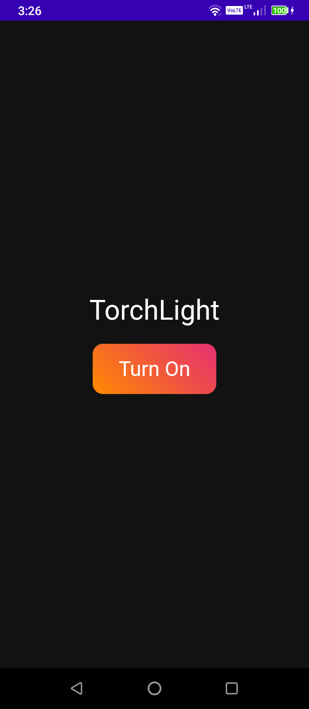

# Tauri Plugin Torchlight Example

This is a simple flashlight app that uses tauri-plugin-torchlight.



## Running the example

- Install dependencies and build the package (run inside the root of the repository)

```bash
$ npm install
```

- Run the app in development mode (Run inside of this folder `examples/tauri-plugin-torchlight-example/`)

```bash
$ npm run tauri android dev
```
